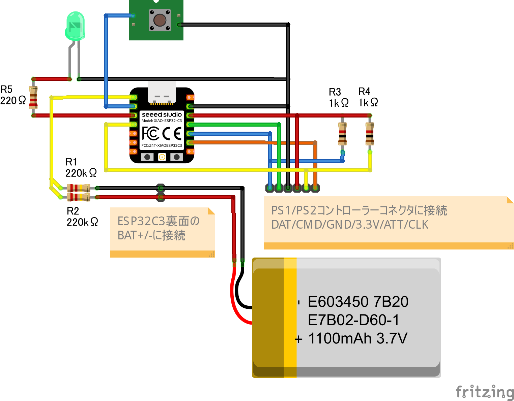

# PS2 BLE Gamepad

PlayStation 1/2 の有線コントローラーを BLE HID ゲームパッドとして動作させる ESP32 用 Arduino スケッチです。
XIAO ESP32C3の利用を想定したものです。

## 必要なライブラリ

- [PsxNewLib](https://github.com/SukkoPera/PsxNewLib) — PS1/PS2 コントローラー読み取り（ビットバン方式）
- [ESP32-BLE-Gamepad](https://github.com/lemmingDev/ESP32-BLE-Gamepad) — BLE HID ゲームパッド

## ピン配置

| 機能           | ピン番号 |
| -------------- | -------- |
| PS2 ATT (CS)   | 5        |
| PS2 CMD (MOSI) | 10       |
| PS2 DAT (MISO) | 9        |
| PS2 CLK        | 8        |
| 電源ボタン     | 3        |
| LED            | 4        |
| バッテリー電圧 | A0       |

> バッテリー電圧は分圧回路を介して A0 に入力してください。  
> また、電圧の最大値/最小値は利用するバッテリーにあわせて適宜統制してください。

## ボタンマッピング

| PS2 ボタン | BLE ボタン番号 |
| ---------- | -------------- |
| Cross      | BUTTON_1       |
| Circle     | BUTTON_2       |
| Square     | BUTTON_3       |
| Triangle   | BUTTON_4       |
| L1         | BUTTON_5       |
| R1         | BUTTON_6       |
| L2         | BUTTON_7       |
| R2         | BUTTON_8       |
| Select     | BUTTON_9       |
| Start      | BUTTON_10      |
| L3         | BUTTON_11      |
| R3         | BUTTON_12      |
| 十字キー   | HAT スイッチ   |

アナログスティックは X / Y / Z / Rz 軸にマッピングされます。

## 機能

- **BLE HID ゲームパッド** — PC・スマートフォン・ゲーム機などに接続可能
- **アナログスティック対応** — DualShock 系コントローラーのスティック入力を送信
- **バッテリー残量通知** — BLE 経由でホストにバッテリーレベルを通知（5% 刻み）
- **ディープスリープ** — 電源ボタンを 1 秒長押しでスリープ、同ボタンで復帰

## ライセンス

PsxNewLib を継承して GNU GPL v3 またはそれ以降のバージョンに従います。
